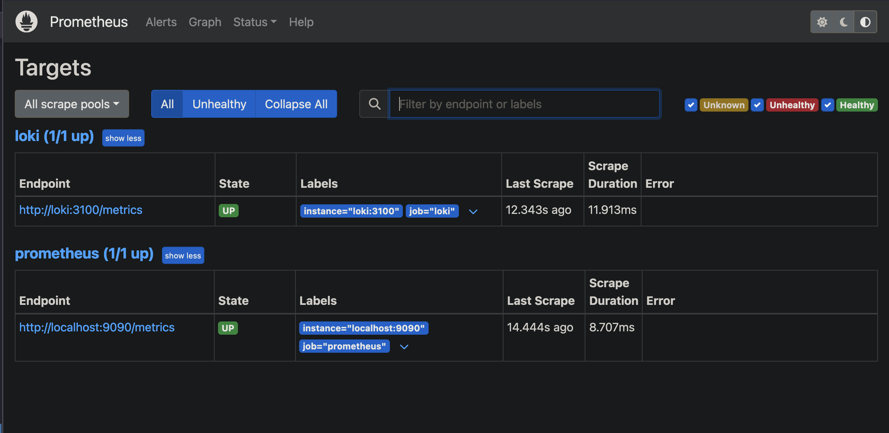

# Metrics Monitoring

## Prometheus Setup

### Configuration
Prometheus has been configured to scrape metrics from:
- Prometheus itself (localhost:9090)
- Loki (loki:3100)

### Verification

## Target Status
- Prometheus: UP
- Loki: UP

## Notes
- Scrape interval is set to 15s
- Evaluation interval is set to 15s 